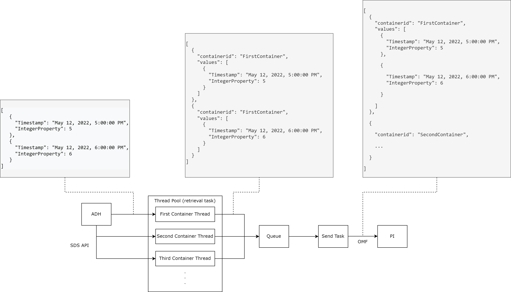

# AVEVA Data Hub to PI Data Archive Python Sample

**Version:** 1.0.0

Developed against Python 3.9.1.

## Requirements

- Python 3.7+
- Register a [Client-Credentials Client](https://datahub.connect.aveva.com/clients) in your AVEVA Data Hub tenant and create a client secret to use in the configuration of this sample. ([Video Walkthrough](https://www.youtube.com/watch?v=JPWy0ZX9niU))
  - Note: the client only needs role with read permissions to the specified streams.
- Install required modules: `pip install -r requirements.txt`
- Requires the PI Web API and that the default server of the PI Web API is the desired server to send to.

## About this sample

This sample uses REST API calls to the Sequential Data Store of AVEVA Data Hub to collect Types, Streams, and data and create corresponding PI Tags in a Data Archive. The sample uses the architecture outlined below where data is feed into a queue from a data retrieval task and events are read from the queue by the send task to be sent to the PI Data Archive. Within the retrieval task, individual threads are spun up to parallelize data retrieval, improving performance. Within the send task, data is batched together from any number of streams and sent when there are more than 5000 events to be sent or more than 30 seconds has elapsed. This ensures that data is sent in order and is more performant than continuously sending data.



## Configuring the sample

The sample is configured by modifying the file [appsettings.placeholder.json](appsettings.placeholder.json). Details on how to configure it can be found in the sections below. Before editing appsettings.placeholder.json, rename this file to `appsettings.json`. This repository's `.gitignore` rules should prevent the file from ever being checked in to any fork or branch, to ensure credentials are not compromised.

There are some PI Point settings that cannot be configured programatically through OMF, but may be desireable. Compression for example is enabled by default on most PI Data Archives, which may or may not be desireable. To modify a PI Point's configuration, first run the sample until the new PI Points have been created and then modify then use either in PI System Management Tools or using PI Builder in Excel.

### Configuring appsettings.json

AVEVA Data Hub is secured by obtaining tokens from its identity endpoint. Client-credentials clients provide a client application identifier and an associated secret (or key) that are authenticated against the token endpoint. You must replace the placeholders in your `appsettings.json` file with the authentication-related values from your tenant and a client-credentials client created in your ADH tenant.

```json
{
  "DataHub": {
    "Resource": "https://uswe.datahub.connect.aveva.com",              # This is the base ADH URL being used
    "ApiVersion": "v1",                                                # The API version
    "TenantId": "PLACEHOLDER_REPLACE_WITH_TENANT_ID",                  # The Tenant Id of the Tenant that is being read from
    "NamespaceId": "PLACEHOLDER_REPLACE_WITH_NAMESPACE_ID",            # The ID of the Namespace that is being read from
    "CommunityId": null,                                               # The ID of the Community that is being read from (If specified the Namespace Id will be ignored)
    "ClientId": "PLACEHOLDER_REPLACE_WITH_APPLICATION_IDENTIFIER",     # The ID of a client with the necessary permissions
    "ClientSecret": "PLACEHOLDER_REPLACE_WITH_APPLICATION_SECRET"      # The Secret of the above client
  },
  "PI": {
    "Resource": "PLACEHOLDER_REPLACE_WITH_PI_WEB_API_URL",             # The URL of the PI Web API server (Should end in /piwebapi)
    "Username": "PLACEHOLDER_REPLACE_WITH_USERNAME",                   # The username of the account used to authenticate to the PI Web API
    "Password": "PLACEHOLDER_REPLACE_WITH_PASSWORD",                   # The password of the account used to authenticate to the PI Web API
    "VerifySSL": true                                                  # A feature flag for verifying SSL when connection to the PI Web API. It is true by default as we strongly recommended that SSL be checked.
  },
  "Queries": [
    {
      "Value": "Id:StreamDemo1"                                        # A search string to find streams to be transferred. Multiple queries may be specified and they adhere to SDS search syntax.
    },
    {
      "Value": "S*"
    }
  ]
}

```

## Running the sample

To run this example from the command line once the `appsettings.json` is configured, run

```shell
python program.py
```

## Running the automated test

To test the sample, start by setting `Queries` in the `appsettings.json` to

```json
"Queries": [
  {
    "Value": "Id:DataHubToPIStream"
  }
]
```

Then run

```shell
pip install pytest
python -m pytest test.py
```

---

Tested against Python 3.9.1

For the main ADH samples page [ReadMe](https://github.com/osisoft/OSI-Samples-OCS)  
For the main AVEVA samples page [ReadMe](https://github.com/osisoft/OSI-Samples)
